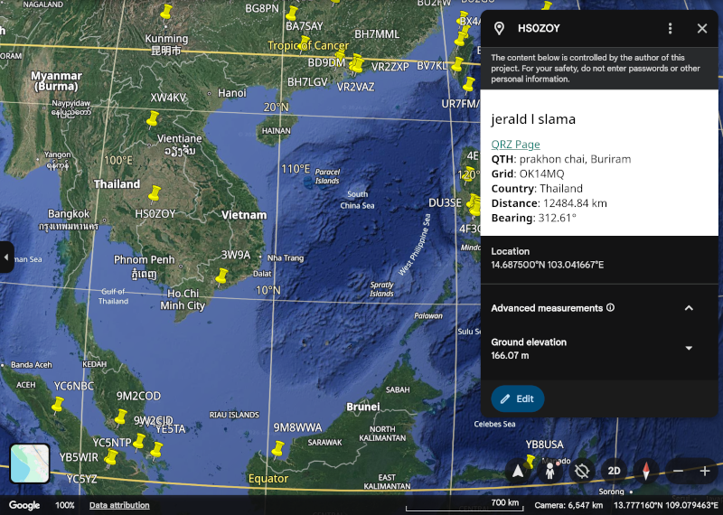

# adi2kml

Scheme scripts for reading an Amateur Data Interchange Format (ADIF) file
and writing the data into Keyhole Markup Language (KML) format.

Most loggers and sites like [QRZ](https://www.qrz.com/) support ADIF file export.

## Demo

You can run a quick demo in three easy steps.  No installation required.

1. Download the [sample.kml](https://raw.githubusercontent.com/ko6iue/adi2kml/refs/heads/main/sample.kml) I generated using QSOs over the last six months.
2. Visit the [Google Earth](https://earth.google.com/) web site.
3. Upload the KML file using the "Open local KML file" feature.

The web interface can look different based on your browswer and/or if you are logged into Google.

If you see a menu bar, click the "File" menu and then choose `Open local KML file`. Some interfaces, just have an `Open local KML file` button.

You do **not** need to login to Google to use this program.



Navigate the earth with your mouse.  As shown above, if you click on a QSO pin, a popup will show the ooperator's name, QRZ page link, QTH, maidenhead grid, country, distance from your QTH, GPS coordinates, and bearing in degrees.

## Running adi2kml

You will need to install [CHICKEN scheme](https://www.call-cc.org/) and then use
`chicken-install` to install the necessary modules: `regex`, `regex-case`, `srfi-1`, `srfi-48`, `sxml-serializer`, `abnf`, `lexgen`.

CHICKEN scheme runs on [a number of different platforms](https://wiki.call-cc.org/portability) so `adi2kml` should run on your favorite (or semi-favorite) OS. I've only tested it on Linux.

Clone this github repo by running:

```
$ git clone https://github.com/ko6iue/adi2kml.git
$ cd ./adi2kml
```

You can run `adi2kml` two ways: scheme script or compiled C binary.

To run the script, use a commandline like the following:

```
$ ./adi2kml.scm JK42GO input.adi output.kml
```

assuming your QTH maidenhead grid is `JK42GO`, your ADIF file is named `input.adi`, and you want to export all the QSOs into `output.kml`.

To compile the scheme scripts into a C binary, run the following command

```
$ csc -o adi2kml adi2kml.scm
```

You use the binary, just like the script, running e.g.

```
$ ./adi2kml JK42GO input.adi output.kml
```

## Performance

The scheme script is able to process about 2000 QSOs per second.

```
$ time ./adi2kml.scm JK42NO ../chicken/archive/sample.adi sample.kml
Processed 1267 unique callsigns with maidenhead data

real    0m0.553s
user    0m0.539s
sys     0m0.013s
```

The compiled binary is able to process about 3000 QSOs per second.

```
$ time ./adi2kml JK42NO ../chicken/archive/sample.adi sample.kml
Processed 1267 unique callsigns with maidenhead data

real    0m0.397s
user    0m0.382s
sys     0m0.015s
```

This was run on my laptop with a Intel i9-14900HX (32) @ 5.600GHz processor.

Both the script and binary version of the program use very little memory. The `adi2kml` program is designed to stream the ADIF directly to KML with as little intermediate data as possible.

## Maidenhead Calculations

The `adi2kml.scm` script loads the `maidenhead.scm` file in order to have methods for converting maidenhead coordinates to GPS and calculating bearing and distance between two maidenhead locators.

All GPS coordinates, bearing, and distances are calculated and do not rely on that information being present in the ADIF file.

The maidenhead grid square you provide on the `adi2kml` commandline is used in these calculations.

## Limitations and TODOs

* The ADIF parser I wrote uses simple regular expressions. It works for ADIF files exported by [QRZ](https://qrz.com) and [QLog](https://github.com/foldynl/QLog) but your mileage may vary. There is currently no support for the ADX File Format.
* Only the first QSO for each callsign is processed. The others are ignored; otherwise, a person you talk with often will have multiple pins at their location.  This could be handled better in the future.
* I have just started writing tests, mostly for the maidenhead calculations since it is more complex code.

## Contributions

Pull requests are bug reports are welcomed.
